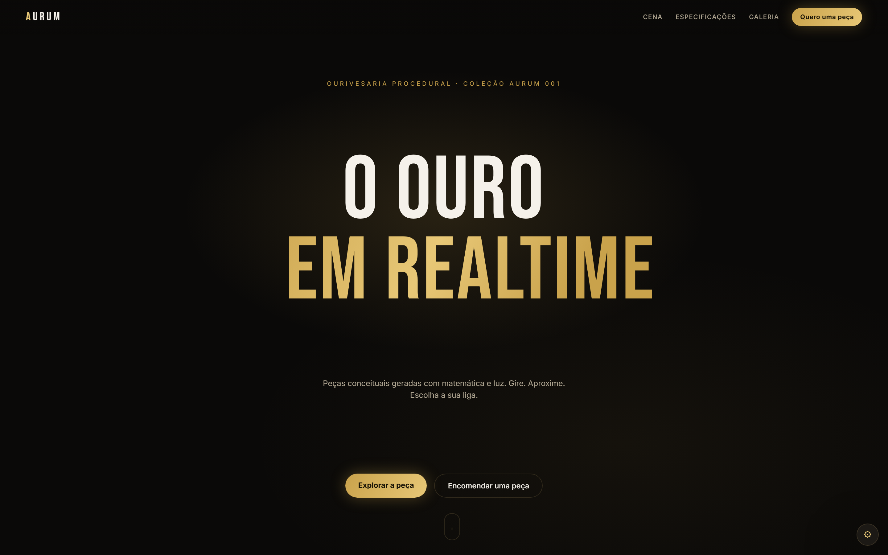
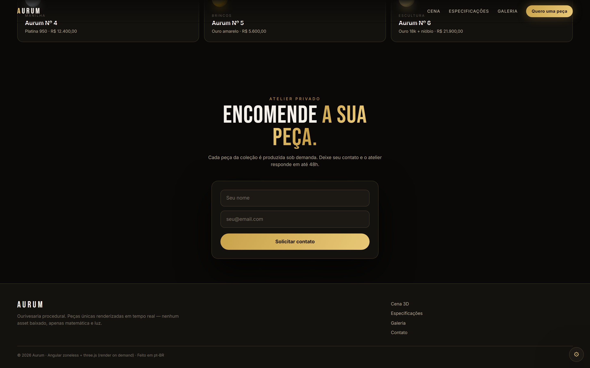

# Aurum — angular-aurum-3d

> Semana(s): 5 · Pilar: **Showcase** · Teste unitário: **Karma** · Milestone(s): `m1-aurum`
> Repo público: [github.com/zecki1/angular-aurum-3d](https://github.com/zecki1/angular-aurum-3d)

## Objetivo de entrevista

integrar three.js em Angular com performance (render on demand + budgets de bundle)

## Stack

- **Angular 22** — standalone, signals, zoneless, OnPush por padrão
- **Supabase** — Postgres + Auth + RLS (projeto compartilhado `angular-portfolio`)
- **Tailwind CSS** · **GSAP** (motion) · **three.js** (3D) · **Playwright** + **axe** (E2E/a11y)
- **Vercel** — build estático (sem cold start, sempre online)

## Fluxo de trabalho (Git)

Ambientes preservados em **português brasileiro** (commits, PRs, issues, CI).

```
main      → produção (build estático; nunca push direto)
homolog   → validação/release de PRs (staging)
develop   → integração diária (merges das branches feat/*)
feature   → feat/<assunto> + PR para develop (boas práticas de código limpo)
```

- **Commits:** `feat:`, `fix:`, `test:`, `docs:`, `design:`, `ops:`, `backend:` (conventional commits)
- **PRs:** sempre via **pull request template**; revisados e mergeados por milestone
- **main:** protegida — merge somente via PR de `homolog`
- Rastreabilidade com issues, labels (`feat/test/design/ops/backend`), milestones e releases

## Rodando localmente

```bash
npm install        # postinstall gera src/environments/ambiente.local.ts
npm start            # ng serve
npm test             # unitário (Karma)
npm run test:ci      # unitário em modo CI (coverage)
npm run e2e          # Playwright (local)
npm run e2e:ci       # Playwright (CI)
npm run build        # ng build
npm run analyze      # source-map-explorer (análise de bundle)
npm run env          # regenera o ambiente a partir do .env
```

## Ambiente (Supabase)

Variáveis em `.env` (nunca commitadas) — copie de [`.env.example`](./.env.example):

```
VITE_SUPABASE_URL=
VITE_SUPABASE_ANON_KEY=
VITE_SUPABASE_PROJECT_SLUG=aurum-3d
VITE_ROLE=demo
CLARITY_PROJECT_ID=
```

`scripts/gerar-ambiente.mjs` transforma essas variáveis em
`src/environments/ambiente.local.ts` (gitignored) no `postinstall`/`prestart`/`prebuild`.
Sem `VITE_SUPABASE_URL` a app roda em **modo demo**: leads no `localStorage` e produtos no
mock local — o front nunca trava por falta de backend.

Dados usados: **`products`** + **`leads`** — migrations, RLS e seed em
[`supabase/`](./supabase/README.md), aplicados no projeto compartilhado `angular-portfolio`.

## Decisão de teste: Karma

> three.js/WebGL **exige WebGL real** (contexto de browser) — rodar a cena em `jsdom`/Node
> testa o mock, não o renderer. Karma `ChromeHeadless` é honesto aqui: o mesmo Chrome
> da CI avalia `WebGLRenderer` de verdade, e o teste mede o **render on demand** pela
> contagem real de frames (`cena.contagemRender()`), não por spy.
>
> Trade-offs assumidos (matrix §2 do planejamento): DX mais lenta que Vitest (compila +
> abre browser) e setup de infraestrutura, em troca de fidelidade de integração —
> exatamente o contexto que o pilar Showcase (Sem 5) pede. O repositório alterna
> Vitest/Karma de propósito: agnóstico de ferramenta, decisão por problema.

## Checklist DoD

- [x] Build/lint/typecheck limpos
- [x] Unit (Karma) com cobertura ≥ 80% — _121/121 · statements 95,11% / branches 86,28% / functions 92,24% / lines 98,1%_
- [x] E2E Playwright + axe sem violações críticas — _14 testes em `e2e/fluxo-principal.spec.ts` (CI: `.github/workflows/ci.yaml`)_
- [ ] Lighthouse ≥ 90 (Performance/SEO/A11y) — _pendente: rodar em hospedagem_
- [ ] Responsivo (mobile/tablet/desktop) — _testar em dispositivo real_
- [x] README com screenshot + "o que aprendi" + decisão de teste
- [x] Supabase configurado — _migrations + RLS + seed em `supabase/`, aplicados no `angular-portfolio`; `leads` com a coluna `nome`_
- [ ] PR revisado + merged + release por milestone

## O que aprendi

**three.js + Angular com budget apertado**
- `import()` dinâmico do three mantém o chunk (597 kB) **fora do initial bundle**: o
  `main.js` inicial fica em ~429 kB (< 500 kB do budget) e o WebGL só carrega quando a
  cena monta.
- **Render on demand**: ocioso ~16fps, interação frame-a-frame (OrbitControls), com
  `IntersectionObserver` pausando fora da viewport e pulando frames com aba oculta.
- `limpar()` com **dispose completo** (geometrias via `traverse`, materiais, controles,
  renderer, listeners) — sem vazamento de memória ao navegar.

**Testar WebGL em Karma (ChromeHeadless)**
- `document.hidden` e o `IntersectionObserver` são armadilhas no headless: canvas fora
  do DOM reporta `isIntersecting: false` e pausa o render. Stubs controláveis (render on
  demand vira caminho determinístico) e fallback `noopCena()` quando o WebGL falha.
- Disputa `afterNextRender` × `DestroyRef` gerava `NG0911 View already destroyed` —
  guard `destruido` + fixture destruída explicitamente resolvem.
- `environment` são data-properties comuns: `spyOnProperty('get')` falha; mutar e
  restaurar no `afterEach` cobre o caminho Supabase sem spy.

**Signals + zoneless**
- A cena é pura via `CenaMontada` (interface) — o componente comunica cor/`onPronto`
  sem depender de zone, e a galeria compartilha a seleção por signal do `ProductsService`.

**Variáveis de ambiente no Angular 22 (bloco de backend)**
- `import.meta.env` **não funciona** no builder `@angular/build:application`: testei com
  `VITE_PROBE` exportado no build e o valor chega como `undefined` no bundle. A substituição
  só existe via `define`, que só aceita literais em `angular.json` — ou seja, a chave
  voltaria para dentro do repo, furando a regra 3 das regras de ouro.
- Daí o `scripts/gerar-ambiente.mjs`: lê `.env`/variáveis do processo e gera
  `src/environments/ambiente.local.ts` (gitignored) antes de `start`/`build`/`test`.
  Mantém o contrato `VITE_*` do §4.5 sem sujar o histórico do git.
- O `leads` do schema-base (§4.2) não tinha a coluna `nome`, que este formulário enviava —
  o POST teria respondido 400 (`PGRST204`) em produção. A migration do fim de semana
  adiciona a coluna e a policy de insert fica presa ao `project_slug` deste app
  (`with check`), para o mesmo Supabase não misturar as bases dos 12 projetos.

## Screenshots

Captura real (Playwright/Chromium) do app rodando:

| Topo (intro + cena 3D) | Rodapé (formulário de lead) |
|---|---|
|  |  |

## Microsoft Clarity (mapa de calor)

Integração documentada em [`docs/clarity-integracao.md`](./docs/clarity-integracao.md).
Snippet só é ativado quando a variável `CLARITY_PROJECT_ID` estiver definida.

## Permanência online

Estratégia zero-standby documentada em [`docs/manter-online.md`](./docs/manter-online.md).
